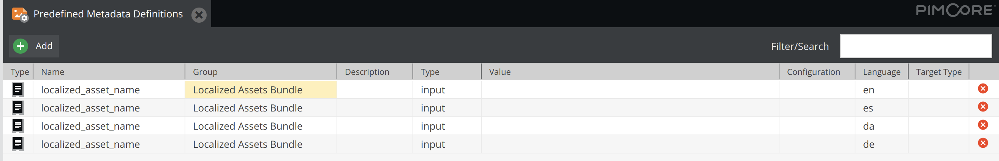
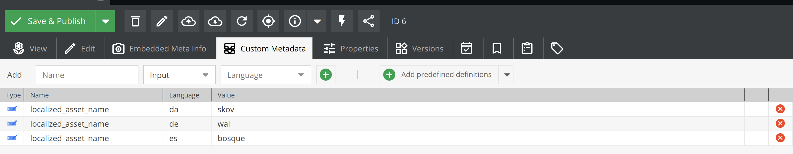

# Localized assets in Pimcore

Pimcore Bundle to localize your assets with same file. 

### Installation
```bash
composer require lemonmind/pimcore-localized-assets
```
```bash
// config/bundles.php

PimcoreLocalizedAssetsBundle::class => ['all' => true]
```
```bash
bin/console pimcore:bundle:install PimcoreLocalizedAssetsBundle
```
After installation predefined assets metadata definitions with name "localized_asset_name" should be visible. Each language should has its own entity.  



### Usage
In specific asset in "Custom Metadata" add predefined metadata from "Localized Assets Bundle" group. Then add values that should be replaced from original name.



So for example if asset has default path **/images/tree.jpg** on spanish page it will be replaced with **/images/bosque.jpg**.

It works in documents and data objects also with thumbnails.


### Run phpstan and php-cs-fixer
There is prepared a composer script to run both phpstan and php-cs-fixer.
```bash
composer fix
```